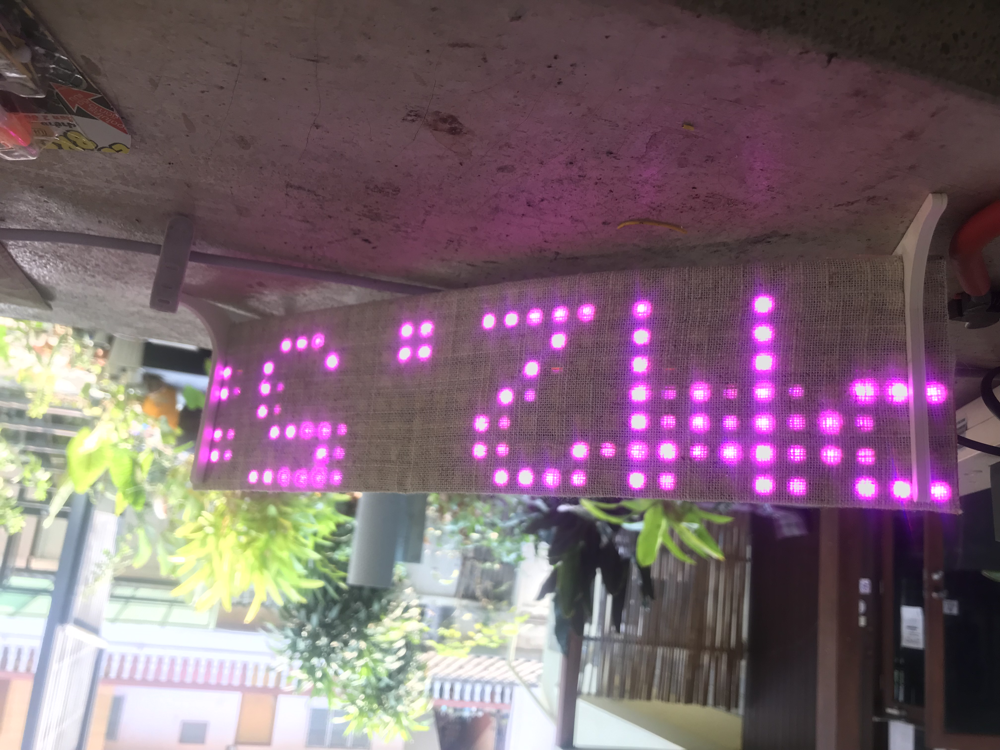
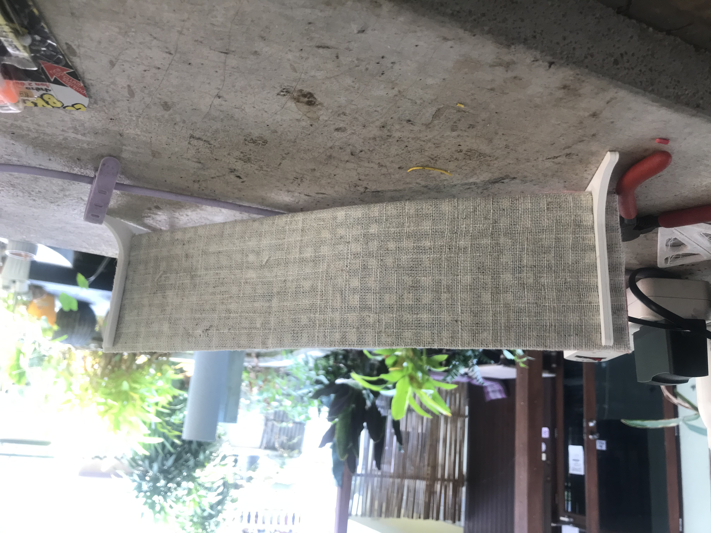

# PM2.5 and Weather Display Project

This project creates an LED matrix display that shows real-time PM2.5 air quality data and weather information for Chiang Mai, Thailand. It uses an ESP32-S3 microcontroller to fetch data from multiple sources and display it on a 32x8 LED matrix.

## Demo

https://github.com/FABBienne/PaRang_Display_2568/assets/Display_PaRang.mp4

## Features

- Real-time PM2.5 air quality monitoring
- Current temperature display
- Weather forecast including:
  - Current temperature and pressure
  - Tomorrow's minimum and maximum temperatures
  - Weather conditions (using weather codes)
- Scrolling text display
- Auto-updating every 60 seconds
- Time zone adjusted display (UTC+7 for Thailand)

## Hardware Requirements

- ESP32-S3 (LOLIN S3 Mini)
- 32x8 LED Matrix (WS2812B)
- Power supply suitable for the LED matrix
- WiFi connection

- 3D-printed stands for the Matrix (files provided under `Matrix_Stand_v0.2`)

## Software Dependencies

- Platform: ESP32 (espressif32)
- Framework: Arduino
- Libraries:
  - ArduinoJson (v6.21.3)
  - FastLED (v3.6.0)
  - WiFi
  - HTTPClient

## Pin Configuration

- LED Data Pin: GPIO4

## Data Sources

1. **Sensor.Community API**
   - PM2.5 data from sensor ID: 85707
   - Temperature data from sensor ID: 85708
   - Endpoint: `data.sensor.community/airrohr/v1/sensor/`

2. **OpenMeteo API**
   - Weather data for Chiang Mai (18.7883°N, 98.9853°E)
   - Provides current conditions and tomorrow's forecast
   - Endpoint: `api.open-meteo.com`

## Installation

1. Clone this repository
2. Install PlatformIO (if not already installed)
3. Create a `include/config.h` file with your WiFi credentials:
   ```cpp
   #define WIFI_SSID "your_ssid"
   #define WIFI_PASSWORD "your_password"
   ```
4. Build and upload to your ESP32-S3:
   ```bash
   pio run -t upload
   ```

## Configuration

The project can be configured through several defines in `main.cpp`:

- `MATRIX_WIDTH`: Width of LED matrix (default: 32)
- `MATRIX_HEIGHT`: Height of LED matrix (default: 8)
- `BRIGHTNESS`: LED brightness (default: 40)
- `HTTP_TIMEOUT`: API request timeout (default: 10 seconds)
- `fetchInterval`: Data update interval (default: 60 seconds)

## Display Format

The display shows the following information in a scrolling format:
1. Current PM2.5 level
2. Local temperature
3. Current weather conditions
4. Tomorrow's forecast (min/max temperatures)

## Known Issues

- Degree symbol display issue: Currently using ASCII 96 (backtick) instead of the correct ASCII 123 for the degree symbol in the font array.

## Contributing

Feel free to submit issues and pull requests.

## License

This project is free software: you can redistribute it and/or modify it under the terms of the GNU General Public License as published by the Free Software Foundation, either version 3 of the License, or (at your option) any later version.

This program is distributed in the hope that it will be useful, but WITHOUT ANY WARRANTY. See the GNU General Public License for more details.

## Credits

- Weather data provided by [Open-Meteo.com](https://open-meteo.com)
- Air quality data provided by [Sensor.Community](https://sensor.community)


